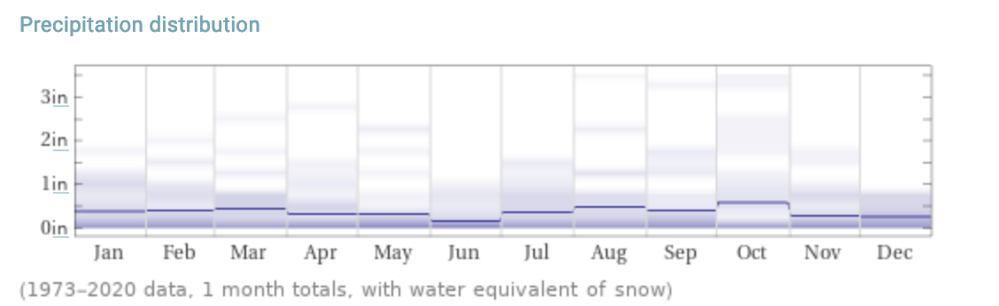
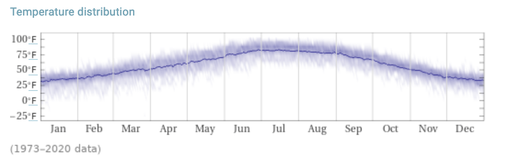

# Coyote Gulch trip.

Red Well to Coyote Gulch is a 27.7 mile moderately trafficked out and back trail located near Escalante, Utah that features a waterfall and is rated as moderate.

---

## Details

Start/end location: 37.43,-111.146

Declination: 10.40° E ± 0.36°

Length: 27.7 mi

Elevation gain: 3,766 ft

Route type: Out & Back

Duration of trip: 4 days/3 nights

## Trail

Starts and ends at the Red Well Trail head, 1.5 miles off Hole-In-The Rock Road.

The route runs along the plateau for 1.5 miles before descending into Coyote Gulch. The gulch slowly narrows and enters a canyon. From there, the trail reaches the confluence with Hurricane Wash at 6.5 miles. At 8.1 miles, you'll reach Jacob Hamblin Arch. We'll try to make camps 1 & 3 here.

Next, we'll arrive at Coyote Natural Bridge at 9.8 miles. Past Coyote Natural Bridge, the trail skirts two sets of waterfalls before reaching the Escalante River where we'll make camp 2 before turning around.

## Water availability

Coyote Gulch contains a number of seeps and springs in addition to a perennial stream. One particularly good spring flows from the canyon wall just downstream from Jacob Hamblin Arch.

## Getting there.

It's a 8.5 hour drive from Denver to Escalante, UT via I-70, UT-24, and UT-12. In Escalante is the Escalante Interagency Visitor Center where we can get permits and trail conditions. From Escalante it's a 1 hour drive to the trail head.

## Climate

For October: Highs in the low 70s to mid 60s, lows in the 50s to mid 20s. <1" of rain.
